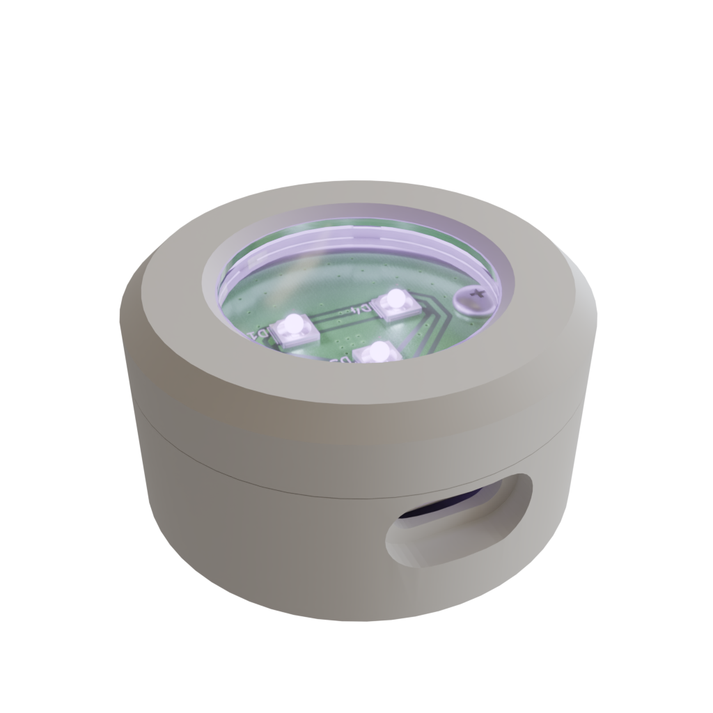
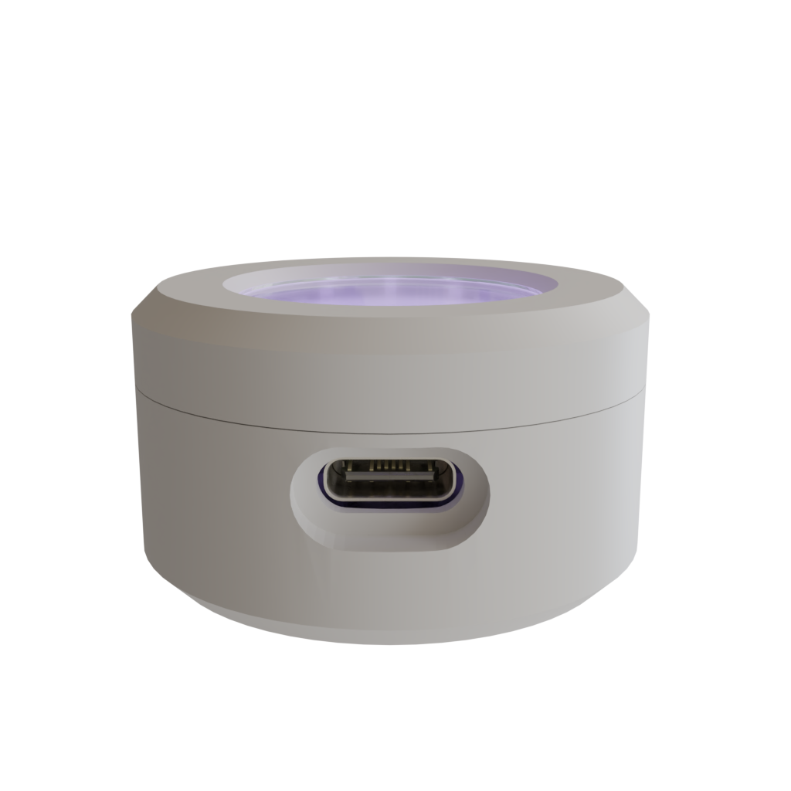
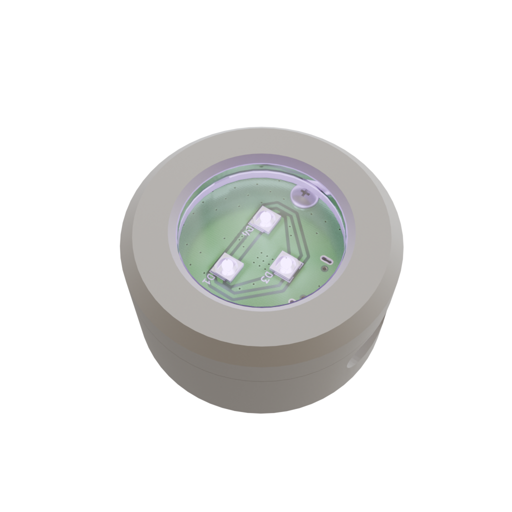
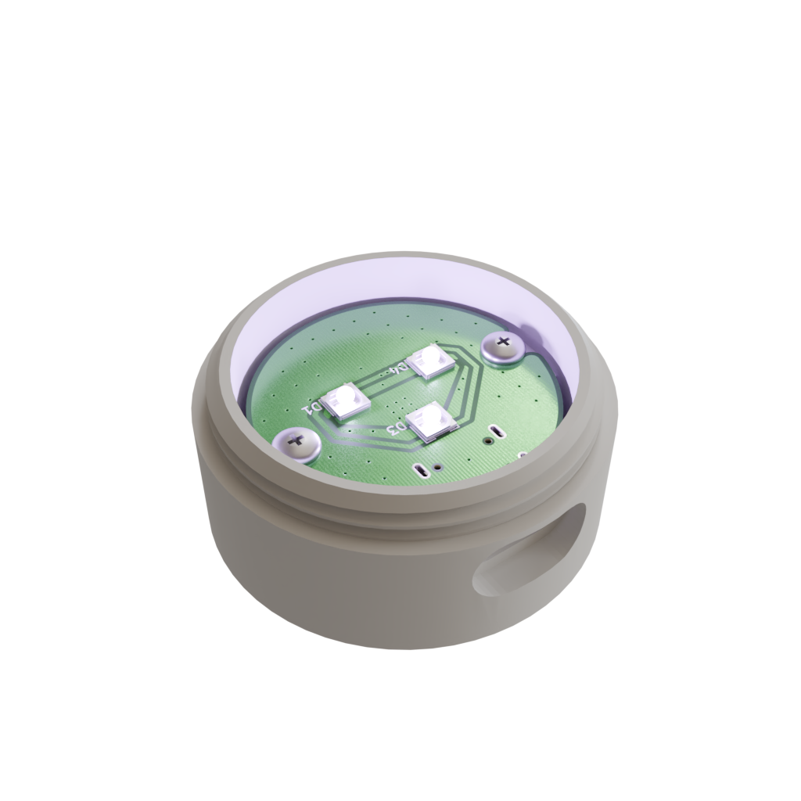

# UV Lamp for soldermask

This project is about designing small UV lamp for hardening soldermask powered by USB-C.

---

    <table>
        <tr>
            <td width="50%">
                
            </td>
            <td width="50%">
                
            </td>
        </tr>
        <tr>
            <td width="50%">
                
            </td>
            <td width="50%">
                
            </td>
        </tr>
    </table>

---

    
*UV Lamp for soldermask*

